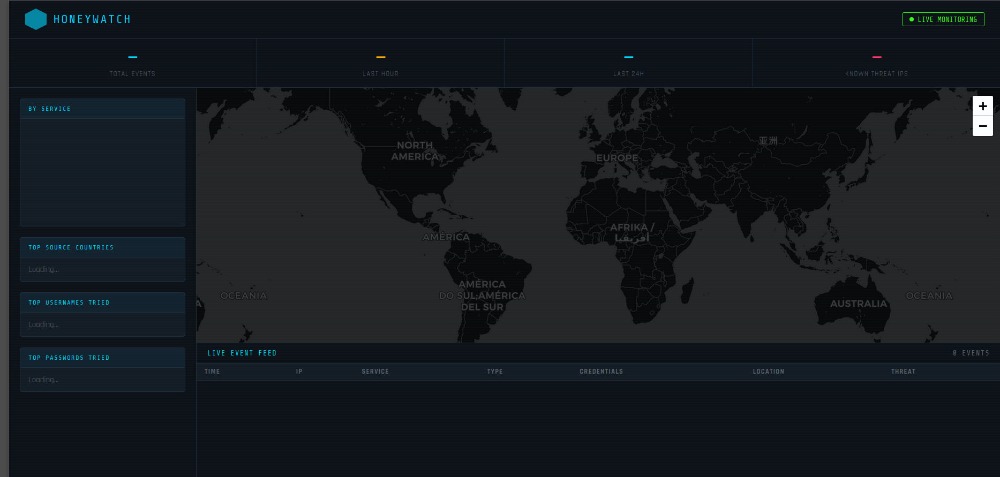

# 🍯 HoneyWatch

A lightweight, production-ready honeypot for **Ubuntu 24.04 LTS** on DigitalOcean (or any VPS). Captures attacker credentials, maps their origins, checks IPs against threat intel databases, and displays everything on a live web dashboard accessible at `http://your-ip:5000`.



---

## Features

| Feature | Details |
|---|---|
| **SSH trap** | Fake SSH server (port 2222) captures all login attempts |
| **HTTP trap** | Fake admin login panel (port 8080) captures credentials |
| **Telnet trap** | Classic Telnet honeypot (port 2323) |
| **FTP trap** | Fake ProFTPD server (port 2121) |
| **Geo-location** | Every attacker IP is resolved to country/city via ip-api.com |
| **Threat intel** | Optional AbuseIPDB integration flags known-bad IPs |
| **Live dashboard** | Real-time web UI with world map, charts, and event feed at `:5000` |
| **Server-Sent Events** | Dashboard updates instantly without polling |
| **SQLite storage** | All events persisted locally — no external DB needed |
| **Systemd service** | Auto-starts on boot, restarts on crash |
| **Optional auth** | HTTP basic auth for the dashboard |

---

## Quick Start (DigitalOcean)

### 1. Create a Droplet

- **Image**: Ubuntu 24.04 LTS x64
- **Size**: Basic $6/month (1 vCPU / 1 GB) is sufficient
- **Region**: Anywhere — pick one close to you

> ⚠️ Use a **dedicated droplet** for honeypotting. Do not run this on a server with sensitive data.

### 2. Deploy

SSH into your droplet as root, then:

```bash
git clone https://github.com/YOUR_USERNAME/honeywatch.git
cd honeywatch
sudo bash install.sh
```

The installer will:
- Configure UFW firewall (keeps port 22 open for your real SSH)
- Create a dedicated `honeypot` system user
- Install Python dependencies in a virtualenv
- Install and start the `honeywatch` systemd service

### 3. Open the Dashboard

Navigate to `http://YOUR_DROPLET_IP:5000` in your browser.

---

## Configuration

Edit `/etc/honeywatch/env` after installation:

```bash
# Honeypot ports
SSH_PORT=2222
HTTP_PORT=8080
TELNET_PORT=2323
FTP_PORT=2121

# Dashboard
DASHBOARD_PORT=5000
DASHBOARD_HOST=0.0.0.0

# Optional: enable HTTP basic auth on the dashboard
DASHBOARD_USER=admin
DASHBOARD_PASS=yourpassword

# Optional: AbuseIPDB for threat intelligence (free API key)
# https://www.abuseipdb.com/register
ABUSEIPDB_API_KEY=your_key_here
```

After editing, restart the service:

```bash
sudo systemctl restart honeywatch
```

---

## Threat Intelligence

Add a free [AbuseIPDB](https://www.abuseipdb.com/) API key to `/etc/honeywatch/env` and the dashboard will flag known-bad IPs in red (⚠ THREAT) with an abuse confidence score.

---

## Dashboard

| Panel | What it shows |
|---|---|
| **World map** | Each attacker plotted — red = known threat, blue = unknown |
| **Stat bar** | Total events, last hour, last 24h, known threat IPs |
| **Service chart** | Events by honeypot type (SSH / HTTP / Telnet / FTP) |
| **Top countries** | Where attacks are coming from |
| **Top usernames/passwords** | Most commonly attempted credentials |
| **Live feed** | Real-time event table with geo + threat data |

---

## File Layout

```
honeywatch/
├── main.py                   ← Entrypoint — starts all services
├── requirements.txt
├── install.sh                ← One-shot installer
├── honeywatch.service        ← Systemd unit file
├── honeypot/
│   ├── services.py           ← SSH / HTTP / Telnet / FTP honeypots
│   └── database.py           ← SQLite storage + geo/threat enrichment
└── dashboard/
    ├── app.py                ← Flask web app + SSE
    └── templates/
        └── index.html        ← Live dashboard UI
```

---

## Service Management

```bash
# Status
sudo systemctl status honeywatch

# Logs
sudo journalctl -u honeywatch -f

# Restart
sudo systemctl restart honeywatch

# Raw log file
tail -f /var/log/honeypot/honeypot.log

# SQLite database
sqlite3 /var/lib/honeypot/events.db "SELECT * FROM events ORDER BY timestamp DESC LIMIT 20;"
```

---

## Security Notes

- **Never** run this on a machine with sensitive data or production workloads
- The honeypot **always rejects** credentials — it never grants real access
- Dashboard port 5000 is open by default; restrict it with `DASHBOARD_USER`/`DASHBOARD_PASS` or via UFW (`ufw allow from YOUR_IP to any port 5000`)
- The service runs as a locked-down `honeypot` system user with minimal filesystem access

---

## Legal

Deploying a honeypot is legal in most jurisdictions when you own the server. You are passively recording connection attempts made to your own system. Always review local laws before deployment. Do not use honeypot data to actively attack or harass any IP.

---

## Extending

| Want to add... | Where to look |
|---|---|
| More honeypot ports | `honeypot/services.py` — copy the pattern from `FTPHoneypot` |
| Email alerts | `honeypot/database.py` — add to `_insert()` thread |
| Export to CSV/JSON | Add a `/api/export` route in `dashboard/app.py` |
| HTTPS on dashboard | Put nginx in front with `proxy_pass http://localhost:5000` |

---

## License

MIT — do whatever you want, but please don't use it maliciously.
